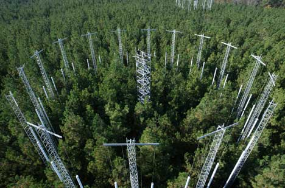

This week's lab will continue our exploration of analytical and numerical approaches to fitting models by maximum likelihood.  Most of the techniques will remain the same but we will be looking at a model of greater complexity.

# Case Study: Effects of Elevated CO2 on Pine Fecundity



The response of ecosystems to elevated CO2 involves not just the change in growth rates of plants, but also the change in their survival and reproduction.  This week's analysis will look at the response of loblolly pine (Pinus taeda) to being grown in both elevated and ambient CO2 under field conditions at a FACE (Free Air CO2 Enrichment) site in North Carolina (LaDeau and Clark 2001).  Part of this data set consists of counts of the number of pine cones on trees in both treatments.  Trees of different sizes are known to vary in their reproductive output, with larger trees being more fecund.  Because we know that the trees under elevated CO2 are growing faster, and thus are on average larger, this analysis will need to account for tree size as a covariate to determine if trees in elevated CO2 produce more seed at a given size (i.e. fecundity | size) or if the increase in fecundity under elevated CO2 is just due to an increase in tree size.  This experiment fortuitously began right as the trees were starting to mature, so there is the additional question of whether CO2 affects the size at which trees reach maturity.

Lets begin by loading up the data and taking a look at it

```{r}
b <- read.table("data/pinecones.txt",header=TRUE,as.is = FALSE)

str(b)
summary(b)
table(b$ring,b$tmt)           ## shows number of trees by ring and treatment

##histogram of cone counts in year 2000
hist(b$c00,breaks=0:92,probability=TRUE,ylim=c(0,1))

##plot of counts by tree size (x-axis) and CO2 (AMB is black, CO2 is red)
plot(b$diam,b$c00,col = b$tmt)
```


The rows in this data set represent observations of individual trees.  The first column in the data set is an ID number (id).  The second (ring) is an indicator of which plot the tree was in – there are 6 circular plots at the FACE experiment.  The third (tmt) indicated which treatments were applied to which rings, where AMB refers to ambient CO2 concentrations and CO2 refers to elevated CO2.  The next column (diam) gives the diameter of the tree at 1.3 m height (diameter breast height) in centimeters.  Other measures of tree size (height, mass, etc.) are highly correlated with diameter.  The final three columns are the cone counts in 1998 (c98), 1999 (c99), and 2000 (c00).  To keep the analysis more manageable we'll focus on just the data from 2000.

## Fecundity Model

For the first phase of our analysis lets focus on the relationship between fecundity (cone count) and tree size (diameter).  Since the number of cones that are produced on a mature individual is positive count data lets assume that cone production, y, is Poisson

$$ L = \prod_{i=1}^{n} Pois \left( y_i \vert g(x_i) \right)$$

where the expected number of cones per tree, g, is a function of tree diameter.  Now that we have specified the data model for our analysis we next need to specify the process model, which is the function g(x).  For g(x) there is some evidence that fecundity increases as the square of diameter, so we will model g as  

$$g(x_i) = a_0 x_i^2$$

Before we get to fitting the model, lets define some variables that specify what data is going to be used in the fitting

```{r}
dia   <- b$diam       ## tree diameters
ncone <- b$c00       	## number of cones in 2000
cones <- (ncone > 0) 	## whether cones are present – this indicates whether tree is mature
tmt   <- b$tmt       	## treatment (elevated vs ambient)
```


Next, lets define our negative log likelihood function for this model

```{r}
##' @param a0   unknown parameter (slope of fecundity/size relationship)
##' @param x    tree diameter at breast height (cm)
##' @param y    cone counts (integer)
likFec = function(a0,x,y){
  g <- a0*x^2               ## expected mean fecundity, g(x),as a function of tree size
  -sum(dpois(y,g,log=TRUE)) ## negative log likelihood
}
```


To try and make the distinction between the data model and the process model clear we've split this R function into two lines, one that calculates g(x), the expected number of cones for a tree of a given size, and the second that calculated the negative log likelihood.  

Now that we have our likelihood function, we'll want to fit it numerically and then take a look at the results, both in terms of the numbers returned and in a basic graph of the fit of the model. As a first pass, lets consider all data from both treatments together

```{r}
out.fec <- optimize(likFec,c(0.001,1),x=dia,y=ncone)
out.fec
a0 <- out.fec$minimum  ## maximum likelihood parameter estimate

plot(dia,ncone)                    ## raw data scatter plot
dseq <- seq(1,30,length=300)       ## seq of x values for drawing curve
lines(dseq,a0*dseq^2,col=3,lwd=3)  ## add fecundity relationship
```


## Maturation Model

From the exploratory data analysis and this initial model of tree fecundity it is clear that there are a large number of trees with a cone count of zero every year and that smaller trees are likely to be reproductively immature.  Therefore our data model needs to account for both the status of the plant (reproductively mature vs. immature) and the variability associated with the count data of the number of cones.  We have already discussed the later part in the fecundity model above so lets take a look at reproductive maturation.  Since maturation is boolean in nature, but a function of tree size, lets treat it as a Bernoulli process:

$$Bernoulli \left( m_i \vert \theta(x_i) \right)$$

where m is the status of a tree being mature and $\theta$, the probability of being mature, is some function of tree diameter, x.  Recall that the Bernoulli is just a special case of the Binomial where the sample size is $n = 1$ (i.e. a single coin toss with some specified probability).

Now that we have specified the data models for our analysis and the process model for g(x), the relationship between size and fecundity, we next need to specify the process model for $\theta(x)$, the relationship between tree size and maturation. For $\theta(x)$ we will need a function that spans the range of diameters and goes from 0 to 1 in the y axis. 

One function that meets this criteria is the probit function, $probit(b_0,b_1)$ which has the same functional form as the normal CDF (pnorm in R). The probit has a nice intuitive interpretation in that the $b0$ of the function, which is analogous to the mean, determines its midpoint (x value where the probability is 0.5) and the $b1$, which is analogous to the standard deviation, determines the steepness of the curve.

```{r}
## example of probit
xseq = seq(0,30,length=200)
plot(xseq,pnorm(xseq,15,3),type='l')
```


### Lab Report Task 1

In fitting the model numerically we're going to need some initial conditions for the routine to start from.  **Make a plot showing maturation (dia vs cones)**.  To this plot **add $\theta(x)$ to the maturation plot**.  Choose the parameters for this function (b0, b1) so that the plots is reasonable given the data.  Specify the values for (b0, b1) in R as a vector named "param".

```{r,echo=FALSE}
    b0 = 0
    b1 = 0
    param = c(b0,b1)
```

This vector will be passed to our likelihood function below.  When choosing initial conditions, they don't have to be a great fit – finding that great fit is the job of the likelihood analysis – they just have to be in the right ballpark (e.g. your curves should show up on the plot of the data).

### Lab Report Task 2

* Similar to `likFec` and the models we constructed last week, code up the negative log likelihood for this model as an R function
* Test your function at your initial guess to verify that the function is working
* Use a numerical optimization function to fit your log likelihood to the data. Make to use an optimization that supports multivariate problems (not `optimize`)

## Combined Fecundity and Maturation

If we observe cones on a tree (y > 0) it must be mature (m = 1) and thus the probability of this observation is

(1a)
$$p(y_i = 1,2,\dotsc) = Bernoulli \left( m = 1 \vert \theta (x_i) \right) Pois \left( y_i \vert g(x_i) \right) $$

This likelihood involves both the probability that an individual is mature and the number of cones that were produced given that the individual was mature.  The probability of zero cones involves two terms, that of an individual being immature and that of it being mature but with no cones are observed.

(1b)
$$p(y_i = 0) = Bernoulli \left( m = 0 \vert \theta (x_i) \right) + Bernoulli \left( m = 1 \vert \theta (x_i) \right) Pois \left( 0 \vert g(x_i) \right) $$

The inclusion of these two terms in the model for zero counts makes it clear that both process models, $\theta(x)$ and $g(x)$, have to be fit simultaneously because fitting them individually (as we just did) misses the fact that some of the trees with a zero count are actually mature.

Lets put our two existing models together in order to define this more complex likelihood function.  This function will include a likelihood that has two parts (when cone counts are zero vs positive) and a `return` statement that defines what the function returns when it is done. `return` statements are optional but useful for more complex functions in order to be explicit about what is being returned.

```{r}
##' @param param   vector of model parameters
##' @param dia     tree diameter at breast height (cm)
##' @param ncone   cone counts (integer)
likfit = function(param,dia,ncone){
  a0 = param[1]
  b0 = param[2]
  b1 = param[3]
  cones = ncone > 0

  ## trees with cones
  dia.cone   <- dia[cones > 0]              	    ## find just the trees with cones
  g.cone     <- a0 * dia.cone^2			              ## Fecundity fnc - g(x)
  theta.cone <- pnorm(dia.cone,b0,b1,log.p=TRUE) 	## maturation probit - theta(x)
  prob.cone  <- theta.cone + dpois(ncone[cones],g.cone,log=TRUE) ## lnL with cones
  
  ##trees with zero counts 
  dia.zero   <- dia[cones == 0]         ## find the trees without cones
  g.zero     <- a0 * dia.zero^2         ## Fecundity fnc - g(x)
  theta.zero <- pnorm(dia.zero,b0,b1)   	## maturation probit - theta(x)
  prob.zero  <- log((1-theta.zero) + theta.zero*dpois(0,g.zero)) ## lnL without cones

  return(-sum(prob.cone,prob.zero))     ## combined -lnL
}
```


Within this function the $dia.*$ lines define the subsets of data that are relevant for each condition.  The $g.*$ line defines the expected value for g(x), the number of cones per tree.  The $theta.*$ line defines the $\theta$ function.  The $prob.*$ line defines the log likelihood for each part corresponding to equations 1a and 1b above.  Take a look at those functions and be sure you understand how they were converted into the calculations above.  Finally, the `return` line calculates the total negative log likelihood by summing up the two terms of the likelihood function.

Having defined the likelihood function the next step is to numerically minimize the negative log likelihood

```{r}
param  <- c(0,0,0)        ## initial guess (update this based on the first two models!)
likfit(param,dia,ncone)   ## verify that the function works
out = optim(param,        ## run numerical MLE
             likfit,
             lower=c(0.001,10,1),
             upper=c(1,30,10),
             method="L-BFGS-B",dia=dia,ncone=ncone)
out                      ## display results
a0  = out$par[1]         ## extract parameters for later use in plotting & analysis
b0  = out$par[2]
b1  = out$par[3]
lnL = out$value
n   = length(cones)
```


### Lab Report Task 3

Make two plots showing fecundity (dia vs ncone) and maturation (dia vs cones) showing both the raw data and the best fit model. For the fecundity plot include two lines, one representing fecundity vs size given maturity, $g(x)$, and the second that is the expected number of cones observed, which combines fecundity and the probability of maturation $g(x) \cdot \theta(x)$ 

## Effects of Elevated CO2 on Reproduction

Now, you may have noticed that the likelihood we wrote made no use of the CO2 treatment information.  We began by fitting the model to the whole data set.  We are next going to fit the model to the ambient and elevated data separately and then compare the fit of the data for the model with a treatment effect to the fit without the effect.  In this approach we are choosing a biologically relevant null model – that fecundity and maturation vary with size but not CO2 – as opposed to simply testing whether each of the effects is different from zero.  In the remainder of the lab we will introduce  concepts related to hypothesis testing and model comparison that we will not get to in lecture for a few more weeks but which we'd like you to have seen now when you are refining your ideas for your independent projects.

To begin model comparison, lets look at how to fit the model to just the data from the ambient treatment.  The first step of this is to extract the subset of data that we are interested in.

```{r}
## Ambient
dia.amb   = b$diam[tmt=="AMB"]   ## tree diameters
ncone.amb = b$c00[tmt=="AMB"]    ## number of cones
```

Next, lets fit the same likelihood model that we did previously but save the output to different variables.  You'll notice that since we've now defined the data sets used by the likfit function differently all we have to do is re-fit the likelihood function as is.

```{r}
out.amb = optim(param,likfit,method="L-BFGS-B",
             lower=c(0.001,10,1),upper=c(1,30,10),dia=dia.amb,ncone=ncone.amb)
a0[2]  = out.amb$par[1]
b0[2]  = out.amb$par[2]
b1[2]  = out.amb$par[3]
lnL[2] = out.amb$value
n[2]     = length(ncone.amb)
out.amb
```

You can compare the "out" and "out.amb" variables and see that the model has converged to different parameter values, which is to be expected since it is operating on a non-random subset of the full data.  In storing the values from the optimization we're converting each of the variables we defined earlier (a0, b0, etc.) into vectors and storing the values from this analysis as the second element in each of those vectors.  This is done just to make comparing their values easier.

###  Lab Report Task 4
Repeat the analysis we just did but this time fit the model for just the elevated CO2 treatement (tmt == CO2).  Save the output to the variable "out.elev" and store the same output values to the third element of the parameter vectors (e.g. a0[3]).  Include a table of the values of the parameters in your lab report

## Model Selection

Finally, we'll perform a _Likelihood Ratio Test_, which is a statistical test that compared two nested models based on their deviance ($-2lnL$).  Nested models are models that have the same functional form but where the reduced version of the model is achieved by fixing parameter values a priori.  For example, from last week's lab the Weibull and Exponential are nested models, where setting the c parameter equal to 1 in the Weibull gives the Exponential.  In the current context, the fit of the model to the whole dataset (out) is a nested version of the model with the CO2 treatment where the treatment effect is dropped.  In this context we're considering the two fits of the data to the two treatments (out.amb and out.elev) as one single model that has the same sample size as the single fit but twice as many parameters.
We haven't covered this yet, but deviance has a chi-square distribution with the degrees of freedom based on the difference in the number of parameters between two models.  In this case the null model has 3 parameters (a0, b0, b1) while the alternate model has six parameters because we have two a0's (ambient vs elevated), two b0's and two b1's.

```{r}
dev.null <- 2*lnL[1]                  ## null model
dev.tmt  <- 2*lnL[2] + 2*lnL[3]       ## model with elevated vs ambient CO2 treatment
LR       <- dev.null - dev.tmt        ## Likelihood ratio
pval     <- 1-pchisq(LR,3)
```


Since the p-value from this test is very small, for most any reasonable alpha (e.g. the traditional alpha = 0.05) we would take this as support for the alternate hypothesis that the treatment (CO2) has a significant effect on maturation and fecundity.

### Lab Report Task 5

Create figures analogous to Task 3 that show the fits for the full model, the ambient-only fit, and the elevated-only fit (i.e. 3 lines per graph, with different colors or symbols for ambient vs elevated data).  Based on these graphs, the parameter values, and the likelihood ratio test, answer the following questions:

1. Does elevated CO2 have an effect on fecundity? (Provide explanation for your answer).
2. Is this effect simply due to there being larger trees in the elevated plots, or does CO2 affect the maturation rate and/or the fecundity of trees (i.e. the cone production at a given tree size)?  If there is an effect, in what direction is it?
