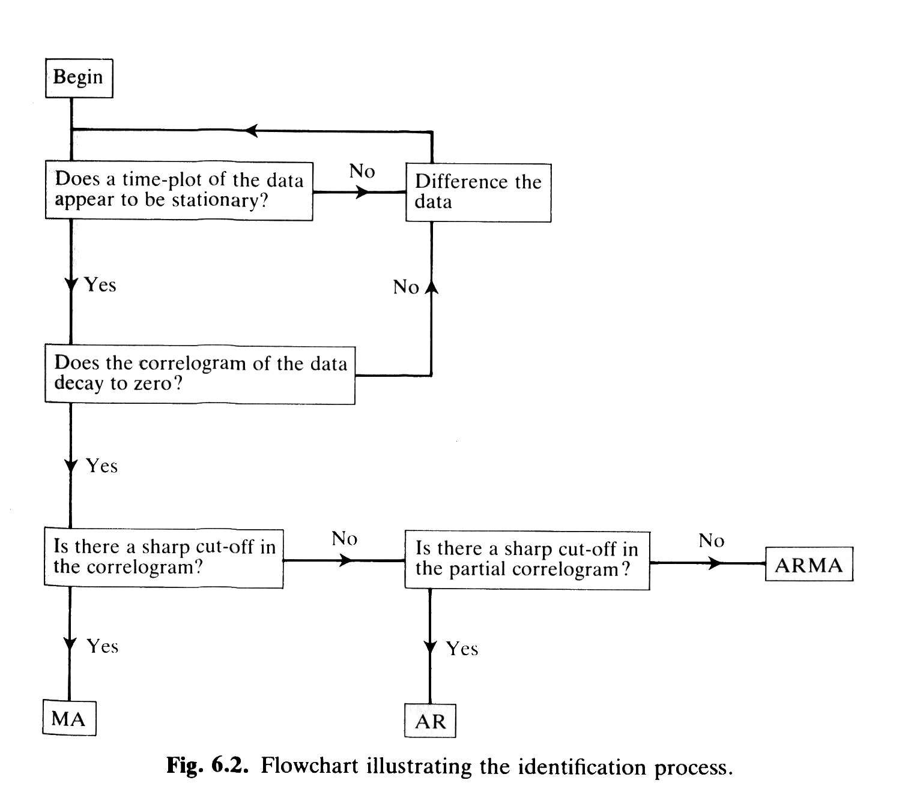

The objective of this week's lab is to familiarize yourself with the tools and techniques to do exploratory analyses for both time series and spatial data sets.  These analyses are useful to gain a better understanding of the data and how it is structured in order to help with the design of more advanced models and should not be done in place of more careful modeling.  We'll start with a spatial case study, since it is likely to generate the most questions, and then move on to a time series example.
 
##Case Study: Ozone Concentrations

For the spatial component of this week's lab we will be looking at concentrations of ozone across the US based on the EPA's Air Quality System (AQS), which is a network of towers measuring ambient air quality (http://www.epa.gov/ttn/airs/airsaqs/).  Data is collected on a number of pollutants and today we will focus on ozone (O3) because it is strongly related to not just human health but also ecosystem health—elevated ozone has significant impacts on crop productivity as well as the growth and survival of native flora and fauna.  Specifically we will be looking at the annual means of hourly ozone concentration data for 2008.  Units are in terms of parts per billion (ppb) and for reference the current health standard is 75 ppb.  The file Ozone.RData contains a data frame dat that records the annual mean, standard deviation, and median ozone at 1225 stations along with each station's ID number and its latitude/longitude coordinates.  The goal of today's analysis is to perform some basic exploratory analyses on the data—fit a trend surface, plot and fit the correlogram and variogram, and produce a kriged map of national ozone levels as well as the uncertainty associated with that map.

Lets start by loading the data and making a simple map of the observations. You will probably need to download one or both of the libraries indicated.

```{r}
library(spatial)          ## spatial stats library
library(maps)               ## map of US
load("data/Ozone.RData")       ## data
plot(dat$Lon,dat$Lat,xlim=c(-125,-65),ylim=c(25,50),asp=70/50,pch="+",col=dat$Mean/10)
map("state",add=TRUE)     ## add the states and then a legend
legend("bottomright",legend=2:8*10,col=2:8,pch="+",cex=1.25)
```

In the above most commands should be familiar or obvious.  The one new bit worth mentioning is the asp variable set in plot.  This locks the y/x aspect ratio so that the US doesn't get stretched/squished when you resize the window.  70/50 is the approximate ratio in km for 1 degree lat/lon within the study region (exact ratio varies with latitude).

Recall that spatial analysis, like time series analysis, assumes second order stationarity, so next we'll want to calculate a trend surface for the data to see to what extent we can detrend the data.
 
```{r}
surf0 <- surf.ls(0,dat$Lon,dat$Lat,dat$Mean)   ## 0-degree polynomial surface
tr0 <- trmat(surf0,-125,-65,25,50,50)          ## project a 50x50 matrix within region
image(tr0,asp=70/50)                           ## make an color image map of the surface
map("state",add=TRUE)
points(dat$Lon,dat$Lat,pch="+",col=dat$Mean/10)
``` 
 
The **surf.ls** command fits a 2D polynomial trend to the data with the degree of the polynomial specified in the first term.  The output of surf.ls provides two things that we care about, the parameters for the polynomial trend and the detrended residuals that we'll use to assess spatial autocorrelation.


The **trmat** (trend matrix) command takes the output of the surf.ls command and creates a list, here called tr0, which contains the x- and y-coordinates of the projection grid, and a matrix z that is the smoothed ozone value in each of the grid cells.  Within this block of code remember from lecture that the 2nd through 5th terms in the trmat command define the boundary rectangle in terms of the latitude and longitude.  The last argument, 50, gives the size of the matrix, meaning that the boundary rectangle of our map will be divided into a 50x50 grid.
 
### Lab Report Task 1

1. Calculate the trend surface for higher order polynomials (at least 1st and 2nd) and include the plots in the lab report.  Do higher order polynomials capture large scale trends or are all the trends finer scale?  **What order polynomial would you choose to detrend your data?**
 

Now that we've calculated a trend surface let’s calculate the correlogram and variogram in order to estimate the scale of spatial autocorrelation. *In the code below, make sure to substitute **surf0** with the polynomial surface you chose from Task 1*:
 
 ```{r}
vg <- variogram(surf0,300,xlim=c(0,10),ylim=c(0,1.1*var(dat$Mean)))

abline(h=var(dat$Mean))                   ## asymptotic variance

cg<- correlogram(surf0,300,xlim=c(0,10))  ## limit the range of radii to the initial decay
```
 
The variogram and correlogram both take the object output from surf.ls as their first argument, from which they are able to access the detrended residuals.  The second argument in both functions is the number of bins that you want to include in calculating the variogram or correlogram.  Be aware that a larger number of bins is not always better because the code will drop bins that have too few observations (<6).  The third argument is just restricting our plots to the shorter distance lags where there is significant autocorrelation.  The units in x are degrees so here “short” distance lags are still 100s of miles.  The units in the y-axis for the variogram are in variance and the abline command provides the overall variance of the data which the variogram should asymptote to at large lags.  The units on the y-axis of the correlogram are in terms of correlation (ranges from -1 to 1).  Both the variogram and correlogram functions provide a plot by default. We are additionally assigning the output of these functions to a variable name so that we can access the data directly.
 
In order to interpolate the ozone values using kriging we need to fit a parametric model for the autocorrelation.  Let's derive a maximum likelihood estimator for the exponential correlation function expcov.  expcov is a built-in R function and you can see the details of the computation by just typing expcov at the command line.  In the following code we'll fit the expcov function to the x and y values from the correlogram (cg$x and cg$y) assuming a Normal likelihood.  Recall that x and y are not actually data but are the bin centers and correlation coefficients calculated from the binned data.  Thus while the graphs may help suggest what functional form is best, we ultimately would want to fit the full spatial model directly to the data (which is beyond today's lab).

```{r}
rng <- 1:10                   ## define the distance bins we want to use for the fit
expfit <- function(theta){    ## negative log likelihood function
  d = theta[1]
  alpha = theta[2]
  se = theta[3]
  sigma = theta[4]
  -sum(dnorm(cg$y[rng],expcov(cg$x[rng],d,alpha,se),sigma,log=TRUE)) 
}
efit <- optim(c(2,0.1,1,0.01),expfit)    ## numerical optimization
efit
```

In the above example we restricted the range of the values from the correlogram to just the first 10 bins.  This was done because we are really just interested in the initial decline phase and the number of bins would change depending on how long it takes the correlogram to converge to zero.

Next, let’s plot the correlation functions over the correlogram to visually inspect the fits.  You should extend this code to include any additional models you fit.

```{r}
par(lwd=2,cex=1.1)
cg <- correlogram(surf0,300,xlim=c(0,10))
lines(cg$x,expcov(cg$x,efit$par[1],efit$par[2],efit$par[3]),lwd=3)
#lines(cg$x,gaucov(cg$x,gfit$par[1],gfit$par[2],gfit$par[3]),col=2,lwd=3)
#lines(cg$x,sphercov(cg$x,sfit$par[1],sfit$par[2],sfit$par[3],sfit$par[4]),col=3,lwd=3)
legend("topright",legend=c("Exponential","Gaussian","Spherical"),col=1:3,lwd=2)

```

## Lab Report Task 2

2.  **EXTRA CREDIT**: There are two other correlation functions built into the spatial package, the Gaussian covariance *gaucov* and the spherical covariance *sphercov*.  Derive MLE for these two functions via numerical optimization.  Turn in an AIC table for the models you fit and identify the best fitting model that you will use for Kriging
3.	Explain the figure generated from the previous box of code. What is being plotted (axes, data, model)? How would you interpret this figure? How would you interpret the parameters of the best-fit model? What is the range? Note: you do not need to include the Gaussian and spherical lines if you did not fit them in the previous step.

Now that we have a covariance function we are ready to proceed with Kriging.  The code below is based on the expcov covariance function and a 0th order polynomial, but **you should use the polynomial you selected previously (and the optimal covariance function, if you completed the extra credit task)**.
 
```{r}
KrExp <- surf.gls(0,expcov,dat$Lon,dat$Lat,dat$Mean,
           d=efit$par[1],alpha=efit$par[2],se=efit$par[3])  ##construct surface
pr3 <- prmat(KrExp,-125,-65,25,50,100)                      ## predict to a matrix
image(pr3,main="Krige",cex.main=2,asp=70/50)                ## image of predictions
contour(pr3,add=TRUE,lwd=1) ## conv to ppb                  ## contours of prediction
map("state",add=TRUE)
points(dat$Lon,dat$Lat,pch="+",col=dat$Mean/10,cex=0.5)
se3 <- semat(KrExp,-125,-65,25,50,150)                      ## error matrix

```

The *surf.gls* function is similar to the *surf.ls* function but it differs in that it takes the spatial autocorrelation into account.  The arguments are the same as for *surf.ls* with the addition that we specify the name of the autocorrelation function in the second slot and the parameters to that function in the last few slots.  The *prmat* function is also analogous to the *trmat* function but instead of just providing the trend, it provides a matrix that includes both the trend and the autocorrelation.  In other words *prmat* is the function that actually does the kriging.  The function *semat* is also very similar to *prmat* and *trmat* except that while *prmat* returns the mean of the prediction semat returns the standard error of the predictions.
 
### Lab Report Task 3

4.  Include your kriged map of mean US ozone for 2008 in your lab report.  Where in the country has the highest ozone levels?
5.	Generate a second map of mean US ozone but this time include contours based on the error matrix rather than the prediction matrix.  Where are ozone levels most uncertain?
6.	There are a few reasons that one might be skeptical of this initial exploratory map.  Name at least two and describe ways the model could be improved (without collecting additional data).

## Part 2: National Ozone Time Series

The .Rdata file you loaded previously contained a second data table, *ozone*, which contains nationally averaged ozone data for 1980-2008.  While the previous data was expressed in terms of average hourly concentration (ppb), this data is expressed in terms of the 4th Maximum 8-Hour Average, which is an odd statistic but one relevant to regulatory criteria.

Let's begin by plotting the data:

```{r}
xt <- ts(ozone$Mean,start=1980,end=2008)  ## convert data to a time series object
plot(xt,type='b',ylab="ppm",xlab="Year",main="National Ozone Concentrations")

```

Next let’s look at a couple of approaches for smoothing the data.  First lets try a weighted moving average with a window of size 5.  This calculates an average value within the window that moves over the time series one point at a time.  Recall that to do a weighted moving average in R we use the more general filter function and then specify a vector of weights (aka the kernel) that is symmetric and sums to 1.

```{r}
k <- c(0.1,0.2,0.4,0.2,0.1)      ## kernel
fx <- filter(xt,k)               ## weighted moving average
plot(xt,type='b',ylab="ppm",xlab="Year",main="National Ozone Concentrations")
lines(fx,col=3)
```

Second, let’s look at a lowess curve.  Recall that a lowess curve also uses a moving window, but instead of an average it calculates a weighted regression model.  The second parameter to the lowess, f, is the window size expressed as a fraction of the whole time series.  In general, window sizes are much larger with the lowess approach than the moving window because we're fitting a curve through the points.  Feel free to play around with the size of f to see how it affects the smoothness of the curve.
 
```{r}
lx <- lowess(xt,f=1/3)
plot(xt,type='b',ylab="ppm",xlab="Year",main="National Ozone Concentrations")
lines(fx,col=3)
lines(lx,col=2)
```

### Lab Report Task 4

7.  Include the above time series plot and briefly describe the features of the overall trend in ozone concentrations.

Now that we've estimated the trend in the data we can remove that trend by subtracting the smoothed time series from the raw time series and look at the characteristics of the residuals.  Remember that after detrending the time series residuals should meet the assumptions of second-order stationarity—mean zero with homeskedastic variance.  For this example lets use the lowess curve as our trend.

```{r}
rx = xt - lx$y        ## residuals around lowess curve
plot(rx)              ## check for homoskedasticity
abline(h=0,lty=2)
hist(rx,10)              ## check for a normal distribution with mean=zero
## Quantile-Quantile plot (by hand)
n = length(rx)
qseq = seq(0.5/n,length=n,by=1/n)
plot(qnorm(qseq,0,sd(rx)),sort(rx),main="Quantile-Quantile")
abline(0,1,lty=2)
```

As an alternative to detrending we can also look at the difference series for the time series.  Differencing a time series can also be used to remove the trend.  In addition, we often conceive of our process models in terms of changes over time rather than absolute magnitudes. 
 
```{r}
dxt = diff(xt)
plot(dxt)
hist(dxt,10)
```

### Lab Report Task 5
8.  Does the detrended data meet the assumptions of second order stationarity? Why or why not?
9.	Does the first-difference time series meet the assumptions of second order stationarity?  Why or why not?

Next let's evaluate the autocorrelation and partial autocorrelation in the time series.  You've seen ACFs quite frequently in MCMCs so you should be fairly familiar with their interpretation.  A partial ACF is a variant of ACF where at each lag we're looking at the autocorrelation after having accounted for the autocorrelation at shorter lags.  The number of significant lags in the partial ACF can be a very useful guide to the number of lags that should be included when modeling the system, for example with an ARIMA model.
 
```{r}
acf(xt)    ## ACF on the original time series
acf(rx)    ## ACF on the detrended data
acf(dxt)   ## ACF on the first difference series
pacf(xt)   ## Partial ACF of the time series
pacf(rx)   ## Partial ACF of the detrended data
pacf(dxt)  ## Partial ACF of the first differences
```
 
Now that we've calculated a number of diagnostics, let’s explore how me might structure our time-series model.  The flow chart below serves as an aid to help suggest what order of the ARIMA(p,d,q) model is likely to be a good description of the data.  You should have already calculated all of the plots necessary in order to work through this flowchart.  As a reminder, the ARIMA(p,d,q) is the general case of the autoregressive model, the moving average model, and the integrated model.  The degree of each of these models are such that an AR(p) model and a MA(q) model are ones that have p or q lags respectively.  An I(d) model is one where we're modeling a data set that has been differenced d times.  Therefore, as examples, an AR(1) model is equivalent to an ARIMA(1,0,0) model, and an MA(1) model on the first-differences of a time series would be an ARIMA(0,1,1).
 

 
 ### Lab Report Task 7
12.  Based on the diagnostics you have already performed, what ARIMA model is likely to perform best? What orders should p, d, and q be? Why? Should you fit the model to xt or rx?
13.	Fit the arima model you proposed using the function arima: 
```
arima(xt,c(p,d,q))
```

Then propose alternative models that are similar to the one you fit (e.g. increase or decrease orders by 1).  Based on AIC scores what model provides the best fit?  Provide a table of models you tried and their AIC scores.
