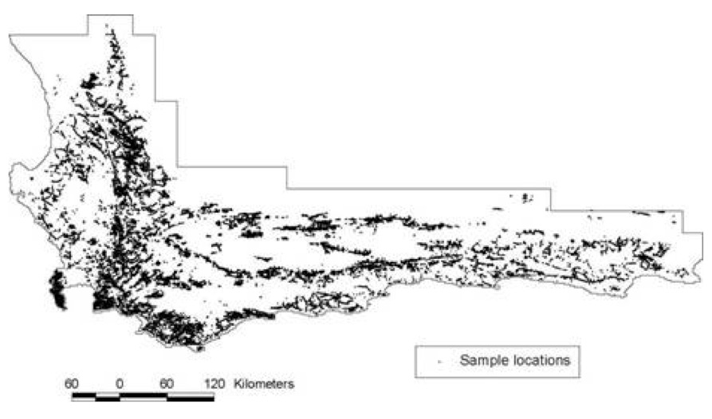

In this week's lab you will look at how space is incorporated into process models.  Specifically we will be using a Conditional Autoregressive (CAR) model for block referenced data, but the concepts of spatial dependency apply equally to point-referenced (geostatistical) data as well as to any class of models where correlation is some function of “distance” between observations.  In terms of point-referenced data in particular, the Markov Random Field model we discussed is just a special case of the CAR model where space is represented as a raster grid.  The other class of point-referenced models we discussed are the maximum likelihood and Bayesian generalizations of the traditional Kriging model that we used in last week's lab on exploratory data analysis in space and time.
 
##Case Study: Species distributions in the Cape Floristic region

This week's lab will look at a model for predicting species distribution maps within the Cape Floristic region of South Africa.  This region is host to some of the highest levels of plant diversity found in any temperate region of the world, with particularly high diversity among the Proteaceae, a family of evergreen shrubs and trees.  In addition, the Cape Floristic region also has an unusually large density of vegetation survey work (see figure) with sampling concentrated in the less developed mountainous regions.



In this lab we will focus on the distribution of Protea cynaroides, a common protea and the national flower of South Africa.  We will assess the distribution of this species in relation to two biological explanatory variables, July (winter) minimum temperature [julmint] and percent low-fertility soil [fert1].  These variables have been normalized in the dataset to reduce parameter correlations among the slopes and intercept, so don't worry about interpreting the absolute values or units of these covariates.  

In order to account for spatial effects, the data have been gridded onto a 1x1 minute grid and species data is recorded as presence/absence.  Since we are dealing with presence/absence data (0/1), which clearly defies the assumption of normality, we will be using a GLMM (Generalized Linear Mixed Model). Specifically, we will be using a logistic regression to model p, the probability that Protea cynaroides is present.  Because there can often be multiple surveys within a grid cell the data model is actually a Binomial (dbin), rather than the more commonly assumed Bernoulli, where n is the number of surveys that occurred in a grid cell and y is the number of such surveys where the species was present.  The number of surveys, n, varies considerably from cell to cell with a range from 0-145, a median of 3 surveys, and ~25% of the cells with zero surveys.

In this lab we will compare two models, the first a standard logistic regression and the second a logistic regression with a Conditional Autoregressive (CAR) random effect.  To implement the second, and to visualize the model output, we will make use of some of the GeoBUGS features that come packaged as part of the BUGS software.

The first thing we need to do in this analysis is to load up the spatial grid that defines the study region.  Rather than work with the full Cape Floristic data set, which is very large and would be very slow to run, we will focus on a smaller 17 x 28 min (~26 x 52 km) subregion that contains 476 grid cells.  To load up the spatial grid, open up BUGS and then within BUGS open the file “map3.txt”, which is the file that defines the grid as set of rectangular polygons (GeoBUGS can load up polygons of any arbitrary shape).  Next go to **Map > Import Splus** menu.  If this command runs correctly you should be prompted for a file name to save the map as a .map file.  Choose something meaningful (e.g. “SouthAfrica” or “CapeFloristic”) and hit save.  Now, in order for the map to show up under the list of available maps you'll need to restart BUGS (i.e. quit BUGS and then open it up again).  You'll want to do this now, rather than after you run the model, otherwise you'll lose the MCMC output that you want to map.

Next, you'll want to open up the “Lab14.odc” file in BUGS, which contains the two models, the data, and a potential set of initial conditions.  This file contains “folds”, which are sets of arrows that can be used to hide the details of the script.  Just click on the arrows to show/hide what is in the fold.  If you want to use folds to organize your own code, they are located in Tools > Create Folds.

For both models you should note that the first loop from `1:N_samples` is the data model and is looping over just those grid cells where data are present.  The `Ind_sampled` vector specifies the rows in the data where there were 1 or more samples.  In the second loop from `1:N_LOC` we are looping over ALL cells and predicting the probability the species is present based on the process model.  Finally the variable extra is just a trick to do something with all the variables defined in the data set that are not used in the model (by now you have undoubtedly noticed that BUGS doesn't like there to be variables in the data that are not in the model).

In second model you'll notice the presence of a car.normal probability distribution that we have not seen before. This is used to specify the spatial dependency in the model based on the Conditional Autoregressive (CAR) model.

Recall that the CAR model is specified as:

$$y_i = \underbrace{\mu_i}_{trend} + \underbrace{{{1}\over{w_{i+}}}\sum_{j \neq i} w_{ij}(y_j - \mu_j)}_{autocorrelation} + \underbrace{\epsilon_i}_{error}$$

The spatial autocorrelation component of this model can be viewed as a random effect that is multivariate normal that has a complex covariance matrix based on a matrix, W, of “weights” assigned to each cell:
 
$$\rho \sim N \left( 0 , (I-\tilde{W})^{-1} \sigma^2 I \right)$$

Recall that while these weights can take on different forms, they are most commonly used to indicate which polygons are adjacent to each other (recorded as a 1) and which are not (recorded as a 0).

In BUGS this distribution is specified as:

```
car.normal(adj[],weights[],num[],tau)
```

Because in block data most locations are NOT adjacent to most other locations (i.e. the matrix is mostly zeros), BUGS uses a sparse matrix format to represent the adjacency matrix, W, based on the vectors adj, weights, and num.  The adj lists the ID numbers of the adjacent areas for each block.  The weights for the car.normal distribution are unnormalized and usually will consist of just a string of 1's for most definitions of adjacency, but may be other values such as 1/distance if using distances between block centroids.  num lists the number of neighbors each block has and is of length N, which is different from adj and weights.  Finally, tau is the spatial precision (1/variance) and is the only real parameter in the car.normal distribution.

The exact format of adj in the car.normal is usually not important because adj and num can be generated using **Map > Adjacency Tool** in GeoBUGS.  To see how this is done go to this menu and select the map you defined previously from the pull down menu.  If your map is not there you may need to make sure the .map file you generated earlier is placed in the “OpenBUGS/Maps/Rsrc” directory and then restart BUGS. Within the Adjacency Tool if you then hit **adj map** it will bring up a map of the grid for our study region.  You can then hit **adj matrix** and it will generate a list that contains the elements num and adj for this grid.  These have already been incorporated into the data for this model otherwise you could cut and paste this into the rest of your data list.  Finally the **show region** button will show the neighborhood for any grid cell that you select in the text window.  This button can be helpful in understanding the ID numbers used in adj.

Before running each model look through the code, make sure you understand what its doing, and ask Mike if you don't understand something.  A few additional hints before you run these models:

−  Read all the tasks first so you know what you'll need to compute for the lab report

−	The data for this model is stored as two parts, a list (“data part 1”) and a matrix (“data part 2”).  Both parts are needed for both models.  Load the data for the first part as you normally would, and then for the matrix you'll want to select the first word of the header row (“MESHCODE”) and click Load Data a second time before compiling the model.

−	Make sure you use the same SCALE and number of bins for the maps when comparing the two models as well as for the interval estimates!

−	The spatial model takes a while to compute so it will be most efficient to make the figures and tables for the first model, then to start the second model, and then work on writing up the first part while the second is running.

−	In more complex models the risk of one or more chains not converging tends to be higher, so it can be useful to specify deviance among the variables that you track so that you can identify and remove a chain that doesn't converge.

## Lab Report Tasks

A)  Make one table of parameter values (posterior mean and CI) and DIC scores that compares the two models.  How does the inclusion of spatial covariance affect the magnitude, direction, and statistical significance of each explanatory variable?  Which model is a better fit to the data?
B)	How do each of the covariates affect whether a given location is suitable habitat for Protea cynaroides?
C)	Map the predictor variables (July minimum temperature and soil fertility). See below for additional instructions on mapping in BUGS.
D)	Map the p's and the 95% CI around the p's for both models.  How does inclusion of spatial covariance affect the spatial pattern of the predicted species range?  How does it affect the uncertainty? 
E)	Map the variable rho.  What does this map represent?  Where is Protea cynaroides less likely to occur than expected based on the covariates?


## Mapping variables in BUGS

1.	Open up the mapping tool using **Map > Mapping Tool** and select your map from the pull down menu.
2.	Enter the variable you are interested in and what about the variable you want to map.  For some selections you will have the option of specifying additional thresholds or quantiles.
3.	Select the color “palate” you want to use for the map.
4.	If you want to have greater control over the map colors and bins, manually change **num cuts** to the number of bins you want and specify the bin thresholds and the bin color values.  This is particularly important to do when comparing maps of the same variable because changes in bin sizes/colors can be very visually misleading.
5.	Click **plot** and the map will come up.  If you put the cursor on any particular cell the numeric value of that cell will be shown in the message window.
